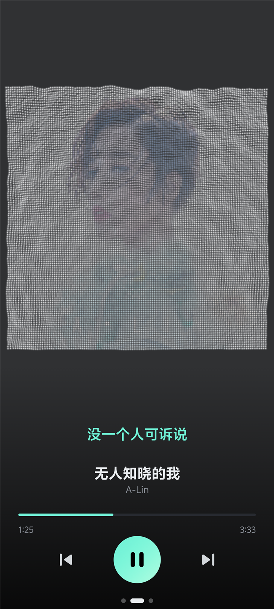
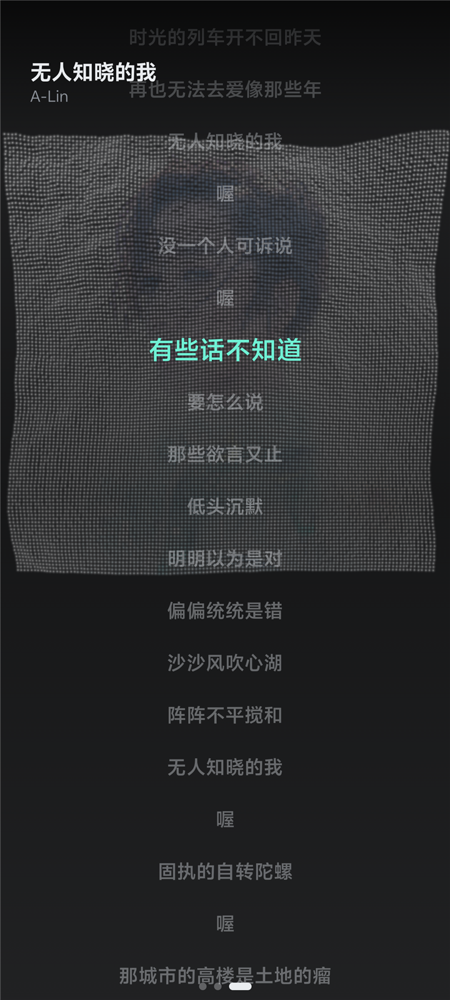
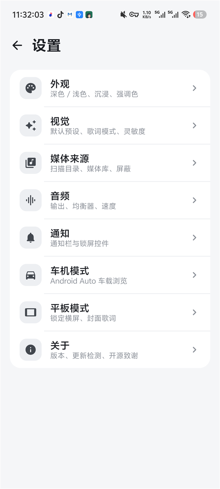
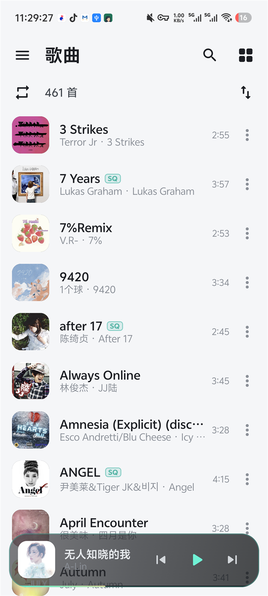
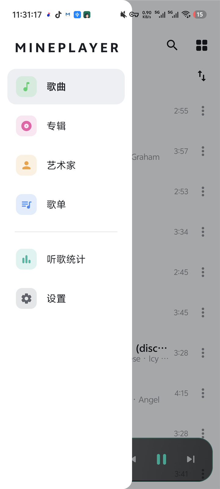
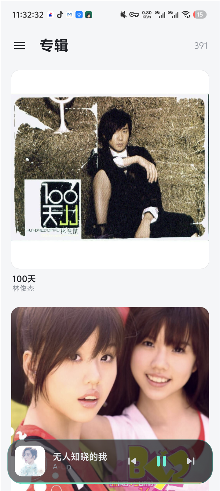

<div align="center">

# 🎵 MinePlayer

**沉浸式本地音乐播放器 · Native Android**

把专辑封面化作律动的粒子，让每一次聆听都有画面。

[](https://github.com/QingJ01/MinePlayer/releases/latest)
[-3DDC84?logo=android&logoColor=white)](#-下载安装)
[](https://kotlinlang.org)
[](https://developer.android.com/jetpack/compose)
[](LICENSE)

[下载安装](#-下载安装) · [功能特性](#-功能特性) · [从源码构建](#-从源码构建) · [技术架构](#-技术架构)

</div>

---

**MinePlayer** 是一个原生 Android 本地音乐播放器，主打**沉浸式粒子视觉**与干净、克制的播放体验。音乐全部来自本机，核心功能无需联网。它把 Web 版 [Mineradio](https://github.com/XxHuberrr/Mineradio) 的招牌视觉，通过将原版 GLSL 着色器逐一移植到 OpenGL ES，原汁原味地带到了移动端。

## ✨ 功能特性

### 🌌 粒子视觉台
- OpenGL ES 2.0 把专辑封面采样成 N×N 粒子矩阵，叠加额外的 Bloom 辉光通道
- 音频实时驱动律动 —— PCM 采样经 FFT 分频，粒子随旋律与节拍起伏
- 多种视觉预设（丝绸 / 黑胶 / 星球 / 隧道等），粒子流动幅度、灵敏度均可调
- 触控可与粒子交互；启动 WebGL 风格开屏、待机程序化星系背景

### 🎵 播放
- 基于 AndroidX **Media3**（ExoPlayer + MediaSession），后台播放、锁屏 / 通知栏控件
- 列表 / 随机 / 单曲循环，队列管理、播放进度记忆、**启动即恢复上次播放**
- 睡眠定时、播放速度调节、播放 / 暂停淡入淡出

### 🚗 Android Auto 车机
- 通过 `MediaLibraryService` 暴露可浏览媒体树：所有歌曲 / 专辑 / 艺术家
- 车机端浏览、点播；曲库懒加载并在设置变更时自动刷新，避免陈旧列表

### 📜 歌词
- 内嵌歌词（ID3 USLT / FLAC Vorbis）+ 外挂 LRC 双通道
- 双语显示、点句跳转、当前句居中；横屏可将当前歌词叠加在封面之上

### 🎚️ 音频处理
- 系统均衡器、压限器、回放增益（ReplayGain 音量平衡）
- 强制输出采样率、无间隙播放（去除曲间静音）、独占音频焦点开关

### 🗂️ 曲库
- MediaStore 全库扫描，或仅扫描**自定义目录**；支持**屏蔽目录**与最短时长过滤
- 按标题 / 艺术家 / 时长 / 添加时间排序；专辑、艺术家、歌单浏览
- 封面墙（歌单架）横向翻览
- 🏷️ **音质标识** —— 依据编码 / 采样率 / 码率自动标注 `HR` / `SQ` / `HQ`
- 📊 **听歌统计** —— 完整听完（30 秒以上）自动计数，统计最常听的歌曲与歌手（后台与车载播放同样计入）

### 🎨 外观与细节
- 深 / 浅色主题（可跟随系统）；强调色支持预置、自定义取色、跟随系统动态色（Android 12+）
- 平板 / 横屏自适应（侧边导航栏、双栏播放页），可锁定横屏
- 沉浸模式、高斯模糊、可开关的媒体通知与关闭按钮
- 应用内检查更新（读取 GitHub Releases，带缓存）

## 📥 下载安装

前往 **[Releases 页面](https://github.com/QingJ01/MinePlayer/releases/latest)** 下载最新的 `MinePlayer-<版本>.apk` 安装即可。

- 系统要求：**Android 9.0（API 28）及以上**
- 安装包体积：约 **5.4 MB**（release 经 R8 裁剪）
- APK 由 GitHub Actions 统一签名，同一签名可覆盖升级

> 首次运行需授予「音乐和音频」读取权限，否则无法扫描曲库。

## 🖼️ 界面预览

<table>
  <tr>
    <td align="center" width="33%"><br/><sub>粒子视觉播放</sub></td>
    <td align="center" width="33%"><br/><sub>全屏滚动歌词</sub></td>
    <td align="center" width="33%"><br/><sub>设置</sub></td>
  </tr>
  <tr>
    <td align="center" width="33%"><br/><sub>曲库（音质标识）</sub></td>
    <td align="center" width="33%"><br/><sub>导航</sub></td>
    <td align="center" width="33%"><br/><sub>专辑</sub></td>
  </tr>
</table>

## 🏗️ 技术架构

| 领域 | 技术 |
|---|---|
| 语言 | Kotlin 2.0（minSdk 28 / targetSdk 34 / JDK 17） |
| UI | Jetpack Compose · Material 3 |
| 播放 | AndroidX Media3（ExoPlayer / MediaSession / **MediaLibraryService**） |
| 视觉 | OpenGL ES 2.0（EGL + 自管理渲染线程）+ 移植自原版的 GLSL 着色器 |
| 音频分析 | `BaseAudioProcessor` PCM tap → FFT → 频段能量 |
| 存储 | DataStore Preferences（设置）+ SharedPreferences（统计 / 播放状态） |
| 构建 | AGP 8.6 · Gradle 8.9 · release 开启 R8 代码裁剪与资源压缩 |

**关键设计**：播放由 `PlaybackService` 持有，UI 通过 `MediaController` 连接 —— 应用界面、通知栏、Android Auto 三端共享同一个会话；听歌统计挂在服务层的 `Player.Listener` 上，因此界面关闭后的后台 / 车载播放同样计入。音频分析器为单例 PCM tap，接入 ExoPlayer 的音频处理链，视觉无论由哪个组件驱动都能保持反应。

<details>
<summary><b>📂 源码结构</b></summary>

```
app/src/main/
├─ java/com/mine/player/
│  ├─ audio/       播放服务、ViewModel、曲库扫描、Media3 桥接、Android Auto 浏览树、音质判定
│  ├─ data/        DataStore 设置、听歌统计、播放状态、歌单、更新检查
│  ├─ lyrics/      内嵌歌词解析（ID3/Vorbis）、LRC 解析、歌词仓库
│  ├─ visual/      音频分析（FFT）、GLTextureView、渲染线程
│  │  └─ gl/       粒子系统、Bloom、骷髅点云、全屏着色器、GL 工具
│  └─ ui/          Compose 界面
│     ├─ screens/  播放页、曲库、专辑、艺术家、歌单、封面墙、统计、设置、开屏
│     ├─ components/ 传输条、歌词视图、玻璃拟态、音质徽章、底部弹窗
│     └─ theme/    调色板、主题、排版
└─ assets/shaders/ cover / bloom / galaxy / skull / splash 的 GLSL 着色器
```

</details>

## 🔨 从源码构建

需要 **JDK 17**（无需安装 Android Studio，命令行即可）。

**Debug 构建：**

```bash
./gradlew :app:assembleDebug
# 产物：app/build/outputs/apk/debug/app-debug.apk
```

**Release 构建（签名）：** 签名信息通过环境变量注入，未设置时自动回退到 debug 签名，本地也能出可安装的 release 包。

```bash
export MINEPLAYER_KEYSTORE_PATH=/path/to/release.jks
export MINEPLAYER_KEYSTORE_PASSWORD=******
export MINEPLAYER_KEY_ALIAS=mineplayer
export MINEPLAYER_KEY_PASSWORD=******
./gradlew :app:assembleRelease
# 产物：app/build/outputs/apk/release/app-release.apk
```

## 🔐 权限说明

| 权限 | 用途 |
|---|---|
| `READ_MEDIA_AUDIO` / `READ_EXTERNAL_STORAGE` | 扫描本机音乐（分别对应 Android 13+ / 更早版本） |
| `MANAGE_EXTERNAL_STORAGE` | 按自定义目录扫描时读取任意路径 |
| `FOREGROUND_SERVICE` · `FOREGROUND_SERVICE_MEDIA_PLAYBACK` | 后台持续播放 |
| `POST_NOTIFICATIONS` | 显示媒体 / 锁屏播放通知 |
| `INTERNET` · `ACCESS_NETWORK_STATE` | **仅**用于检查更新（读取 GitHub Releases） |
| `WAKE_LOCK` | 息屏时保持播放 |

## 🙏 致谢

- 粒子视觉风格与 GLSL 着色器移植自 [**XxHuberrr/Mineradio**](https://github.com/XxHuberrr/Mineradio)（原 Web / Electron 版）。
- 播放能力基于 [AndroidX Media3](https://github.com/androidx/media)，界面基于 [Jetpack Compose](https://developer.android.com/jetpack/compose)。

## 📄 许可证

本项目基于 [**GNU GPL-3.0**](LICENSE) 开源。
